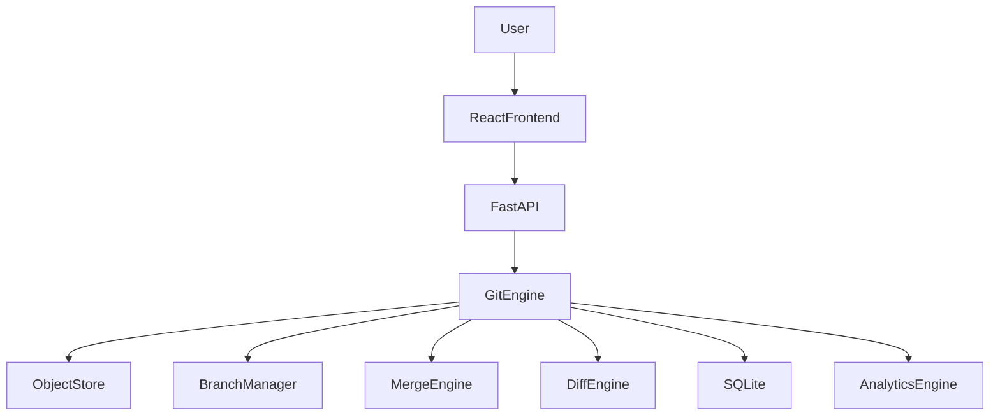
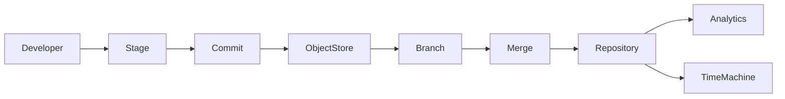

<div align="center">

# ⚡ GitForge

### A Git-inspired Version Control System built completely from scratch.

#### *Understanding Version Control by Building One.*

<p align="center">


</p>

<p align="center">


</p>

---

<p align="center">

<a href="https://gitforge-1.onrender.com">
  
</a>

<a href="https://gitforge-uf8h.onrender.com/docs">
  
</a>

</p>

---

### 🚀 Build • Commit • Branch • Merge • Visualize

*A complete Git-inspired Version Control System featuring an interactive commit graph, repository visualization, merge engine, analytics dashboard and educational documentation.*

---

</div>

# 📖 Overview

GitForge is a **Git-inspired Version Control System** developed entirely from scratch to demonstrate the internal architecture behind modern version control.

Unlike traditional applications that simply wrap Git commands, GitForge recreates the core mechanisms responsible for storing data, managing commits, maintaining branches, performing merges, and visualizing repository history.

The project combines a custom backend engine with a premium React frontend to help developers understand **how version control actually works internally**.

---
## 🎯 Why GitForge?

Most version control projects simply wrap Git commands behind a user interface.

GitForge takes a fundamentally different approach.

It is a **Git-inspired Version Control System implemented completely from scratch**, without relying on Git internally. Every major component—including object storage, staging, commits, branches, commit history, diff generation, and merge operations—was engineered to understand the internal architecture of distributed version control systems.

The project combines a production-style backend with an interactive frontend that visualizes repository history, making complex version control concepts easier to understand while demonstrating real systems engineering principles.

Most developers know how to use Git.

Very few understand:

- How commits are stored
- Why hashes are used
- How branches actually work
- How Git performs merges
- How diffs are generated
- Why Git is so fast

GitForge answers these questions by implementing the underlying concepts from scratch.

---

# ✨ Key Features

### 🌳 Interactive Commit Graph

Visualize repository history as a Directed Acyclic Graph (DAG) with branch relationships and merge commits.

---

## 🎯 Project Goals

- Understand the internal design of distributed version control systems.
- Build a Git-inspired engine without relying on Git commands internally.
- Visualize repository history through an interactive frontend.
- Demonstrate systems programming and full-stack engineering skills.

### 🌿 Branch Management

Create, switch, inspect and manage branches through a modern interface.

---

### ⚡ Diff Engine

Compare commits and inspect changes efficiently.

Supports:

- Added files
- Modified files
- Deleted files
- Line-by-line differences

---

### 🔀 Three-Way Merge

Merge branches using a three-way merge algorithm.

Automatically detects merge conflicts.

---

### 📦 Content Addressable Storage

Every object is uniquely identified using hashing.

Inspired by Git's object storage architecture.

---

### 🧠 Repository Time Machine

Replay repository history commit-by-commit.

Observe how a repository evolves over time.

---

### 📈 Developer Analytics

Generate useful repository insights including:

- Commit frequency
- Repository growth
- File activity
- Branch statistics
- Contribution metrics

---

### 📚 Extensive Documentation

Includes complete documentation covering:

- Concepts
- Architecture
- APIs
- Testing
- Deployment
- Interview Preparation

---

# 🌟 Highlights

- ✅ Git-inspired Version Control Engine
- ✅ Interactive Commit DAG
- ✅ Three-Way Merge
- ✅ Repository Time Machine
- ✅ Developer Analytics
- ✅ FastAPI Backend
- ✅ React + TypeScript Frontend
- ✅ Modern Glassmorphism UI
- ✅ Modular Architecture
- ✅ Educational Documentation

---
## 🏗️ Key Engineering Challenges

Building GitForge required solving several core systems engineering problems:

- Implemented a **content-addressable object store** inspired by Git's internal architecture.
- Designed a **Directed Acyclic Graph (DAG)** for commit history traversal and visualization.
- Built a **three-way merge engine** capable of detecting merge conflicts.
- Developed a custom **file diff engine** for repository comparison.
- Implemented **branch creation, checkout, and reference management** without Git.
- Designed a modular **FastAPI service architecture** separating business logic from API endpoints.
- Created an interactive **Repository Time Machine** for replaying repository evolution.
- Built a responsive React dashboard for repository analytics, commit visualization, and developer insights.

# 🏗 System Architecture



---

# ⚙ Core Modules

## 📦 Object Store

Responsible for storing repository objects using content-addressable storage.

---

## 🌳 Commit Engine

Creates immutable commits connected through parent references.

---

## 🌿 Branch Manager

Maintains lightweight references pointing to commits.

---

## ⚡ Diff Engine

Calculates changes between commits.

Supports efficient comparison of repository snapshots.

---

## 🔀 Merge Engine

Performs intelligent branch merging using a three-way merge strategy.

---

## 📈 Analytics Engine

Processes repository history and generates useful development insights.

---

# 🛠 Technology Stack

| Layer | Technologies |
|---------|-------------|
| Backend | Python, FastAPI |
| Frontend | React, TypeScript |
| Styling | TailwindCSS |
| Animations | Framer Motion |
| Graph Visualization | React Flow |
| Charts | Recharts |
| Database | SQLite |
| Architecture | Service Layer |
| Documentation | Markdown + Mermaid |

---

## 💡 What I Learned

Building GitForge gave me hands-on experience with:

- Designing a Git-inspired Version Control System from first principles
- Content-Addressable Storage
- Commit DAG Construction and Traversal
- Three-Way Merge and Diff Algorithms
- Backend Architecture with FastAPI
- React + TypeScript State Management
- Interactive Graph Visualization
- Software Architecture and Modular System Design

# 📊 Engineering Metrics

| Metric | Value |
|----------|--------|
| Architecture | Modular |
| Backend Framework | FastAPI |
| Frontend Framework | React |
| Database | SQLite |
| Storage Engine | Content Addressable |
| Merge Strategy | Three-Way Merge |
| Documentation | 7 Guides |
| API Style | REST |
| Design Pattern | Service Layer |

---

# 📂 Repository Structure

```text
GitForge
│
├── backend
│   ├── api
│   ├── engine
│   ├── database
│   ├── services
│   ├── models
│   └── utils
│
├── frontend
│   ├── components
│   ├── pages
│   ├── hooks
│   ├── services
│   ├── assets
│   └── styles
│
├── docs
│   ├── Concept Handbook
│   ├── Architecture Guide
│   ├── Developer Guide
│   ├── API Documentation
│   ├── Testing Guide
│   ├── Deployment Guide
│   └── Interview Guide
│
├── README.md
└── LICENSE
```

---

# 🚀 Project Workflow



---
# 🚀 Future Improvements

- Remote Repository Support
- Pack File Compression
- Binary File Diff Support
- User Authentication
- Repository Collaboration
- GitHub-style Pull Requests
- Performance Optimizations

