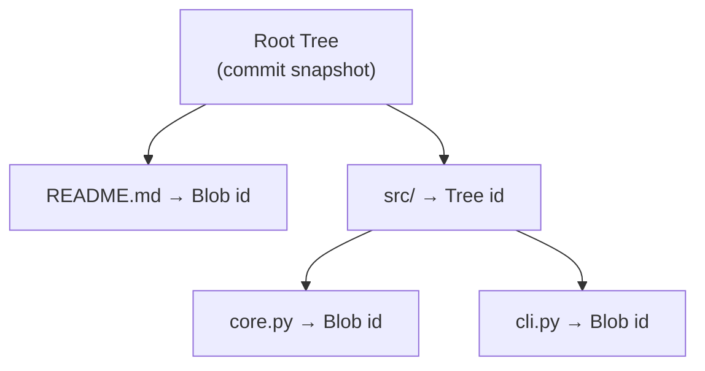
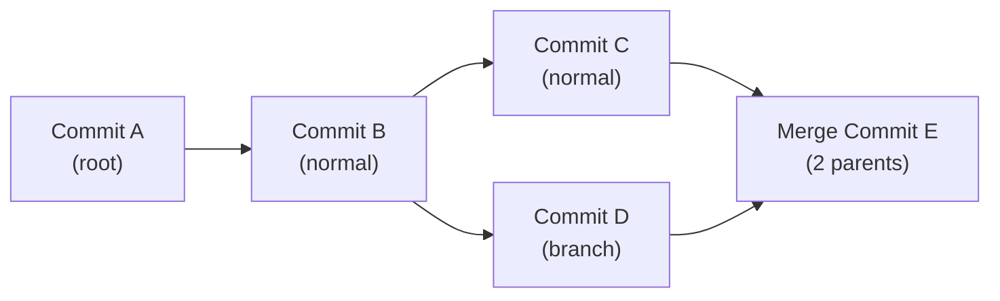
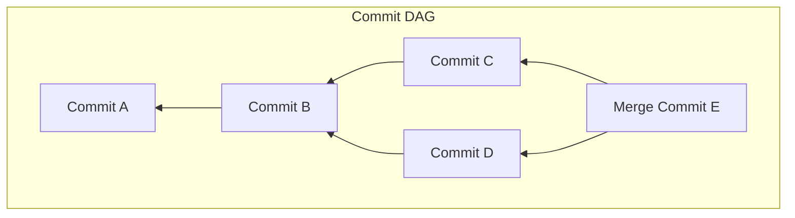
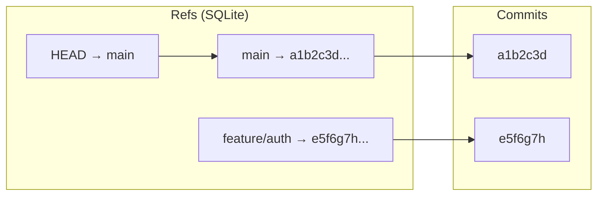
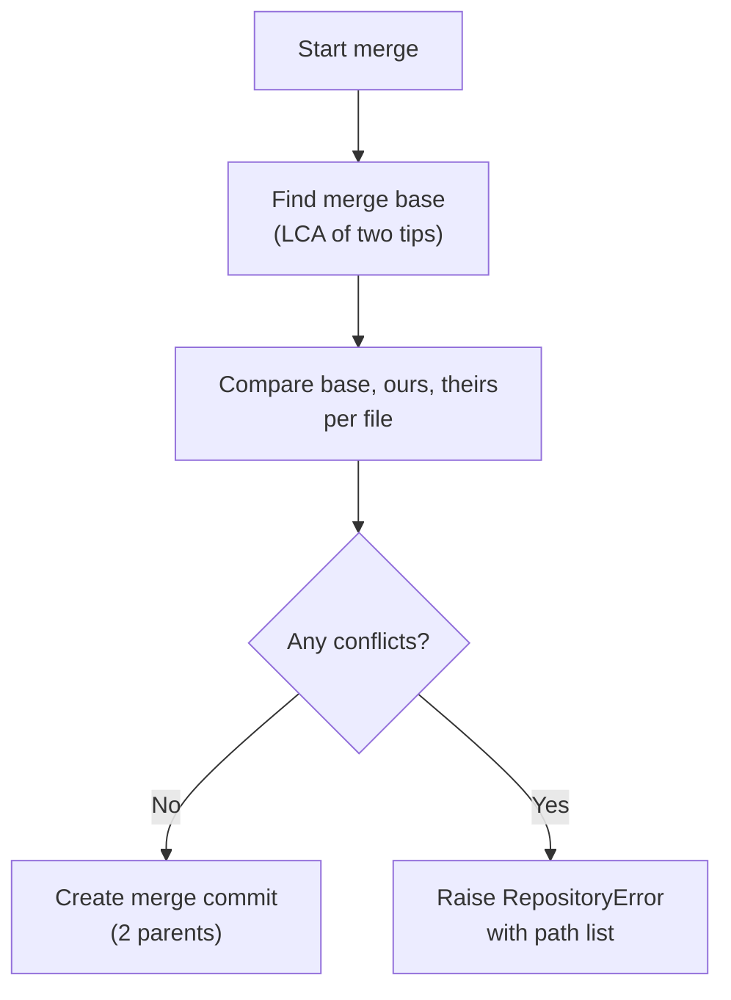

# GitForge Concept Handbook

A **learning book** that teaches every concept in the project from first principles — beginner to advanced — with analogies, Mermaid diagrams, complexity analysis, and trade-offs.

> **Reading order:** Start here before the [Architecture Guide](../02_Architecture_Guide) or [Developer Guide](../03_Developer_Guide).

---

## Table of Contents

1. [Version Control](#1-version-control)
2. [Git vs GitForge](#2-git-vs-gitforge)
3. [Blob](#3-blob)
4. [Tree](#4-tree)
5. [Commit Object](#5-commit-object)
6. [Hashing](#6-hashing)
7. [Object Store](#7-object-store)
8. [DAG](#8-dag)
9. [Branches](#9-branches)
10. [Merge](#10-merge)
11. [Three-Way Merge](#11-three-way-merge)
12. [Diff Algorithm](#12-diff-algorithm)
13. [Repository Layout](#13-repository-layout)

---

## 1. Version Control

### What is Version Control?

Version control is a system that records changes to files over time so you can recall specific versions later. Think of it like an **undo history for an entire project** — every save point (commit) is a full snapshot of every file, and you can jump between them freely.

### Why do we need it?

- **Collaboration:** Multiple people work on the same files without overwriting each other.
- **History:** Every change is logged with who made it and why.
- **Experimentation:** Branches let you try ideas without affecting stable code.
- **Recovery:** You can restore any file from any point in history.

### How GitForge implements it

GitForge implements version control from scratch, mirroring Git's core architecture:

```
User edits files → Stage changes → Commit snapshot → Store in DAG
```

No Git executable is used internally. Every mechanism — object storage, hashing, tree building, diff computation, merge resolution — is hand-implemented in Python.

---

## 2. Git vs GitForge

| Feature | Git | GitForge |
|---------|-----|----------|
| Storage | Content-addressable (`.git/objects`) | Content-addressable (SQLite-backed) |
| Object types | Blob, Tree, Commit, Tag | Blob, Tree, Commit |
| Hashing | SHA-1 | SHA-256 via `hashlib` |
| Staging | Index (`.git/index`) | Index (SQLite table) |
| Branches | References (`refs/heads/`) | `RefStore` (SQLite table) |
| DAG traversal | `git log`, `git merge-base` | `dag.ancestors()`, `dag.merge_base()` |
| Diff | Myers diff (optimized) | LCS diff (educational) |
| Merge | Recursive merge | Three-way merge |
| Frontend | CLI | React + FastAPI + Interactive Graph |

### What GitForge adds

- **Interactive Commit DAG** — React Flow visualization of repository history.
- **Repository Time Machine** — Replay history commit-by-commit.
- **Developer Analytics** — Charts, heatmaps, contributor stats.
- **Insight Engine** — Rule-based annotations (large commits, sensitive files, stale branches).
- **GitHub Import** — Clone any public GitHub repo into the engine.

---

## 3. Blob

A **Blob** (Binary Large Object) is the simplest object in GitForge. It stores the raw bytes of a single file.

```python
@dataclass(frozen=True)
class Blob:
    data: bytes
```

- Blobs are **immutable** — changing file content produces a new blob with a new hash.
- Blobs have no name, path, or metadata. A file's name is stored in the **Tree** that references it.
- Two files with identical content share the same blob (deduplication).

### Analogy

A blob is like a **shipping container** — it holds contents but has no address. The address (filename) is written on the manifest (Tree).

---

## 4. Tree

A **Tree** is a directory snapshot: an ordered list of entries, each mapping a name to either a Blob (file) or another Tree (subdirectory).

```python
@dataclass(frozen=True)
class TreeEntry:
    name: str
    mode: EntryMode  # FILE or DIR
    object_id: str

@dataclass(frozen=True)
class Tree:
    entries: list[TreeEntry]
```

- Entries are **sorted by name** to guarantee deterministic hashing.
- Trees are **immutable** — any change produces a new tree id.
- The root tree of a commit represents the entire repository at that point.



### Analogy

A tree is like a **table of contents** — it lists every file and tells you where to find its content.

---

## 5. Commit Object

A **Commit** is a snapshot of the entire repository at a point in time.

```python
@dataclass(frozen=True)
class Commit:
    tree_id: str        # Root tree of the snapshot
    parents: tuple[str]  # Parent commit(s); empty for root, 1 for normal, 2+ for merge
    author: str         # Author name <email>
    message: str        # Commit message
    timestamp: int      # Unix seconds
    files_changed: int  # Denormalized stats
    insertions: int
    deletions: int
```

### Serialization format

```
tree <tree_id>
parent <parent_id_1>
parent <parent_id_2>  # only for merges
author <Author Name <email>>
timestamp <unix_seconds>
stats <files_changed> <insertions> <deletions>

<commit message body>
```

### Properties

- **Immutable** — changing any field changes the commit id.
- **Parents form a chain** — every commit (except the root) points backward to one or more parents.
- **Stats are denormalized** — `files_changed`, `insertions`, `deletions` are captured at commit time so graph views don't need to recompute diffs.

### Commit types

| Type | Parents | Example |
|------|---------|---------|
| Root | 0 | First commit in repository |
| Normal | 1 | An ordinary incremental commit |
| Merge | 2+ | Combining two branches |



### Analogy

A commit is like a **photograph** of every file at a moment in time. The parents are the "previous photograph" it was taken from.

---

## 6. Hashing

Every object in GitForge is identified by the **SHA-256 hash** of its serialized content.

```python
def hash_bytes(obj_type: str, payload: bytes) -> str:
    return hashlib.sha256(f"{obj_type}\0".encode() + payload).hexdigest()
```

### Properties

- **Content-addressed** — the hash IS the address. Fetch an object by asking for its hash.
- **Deterministic** — same content always produces the same hash.
- **Tamper-evident** — any corruption changes the hash.

### Why SHA-256?

| Hash | Output size | Collision resistance | Git usage |
|------|-------------|---------------------|-----------|
| SHA-1 | 160 bits | Weakened (SHAttered) | Git default |
| SHA-256 | 256 bits | Strong | GitForge choice |

GitForge uses SHA-256 because it's the current standard for cryptographic hashing and `hashlib` provides it natively.

### The hash namespace is flat

Every object — Blob, Tree, Commit — lives in the same flat id space. There is no directory structure. The type prefix (`blob\0`, `tree\0`, `commit\0`) prevents type collisions: a string that's a valid commit id can never match a blob with the same content.

---

## 7. Object Store

The **ObjectStore** is GitForge's on-disk database for all objects. It's backed by a single SQLite table.

```sql
CREATE TABLE objects (
    id      TEXT PRIMARY KEY,
    type    TEXT NOT NULL,   -- 'blob', 'tree', 'commit'
    payload BLOB NOT NULL
);
```

### API

```python
store = ObjectStore(connection)
store.put(blob)              # Serialize + store
blob = store.get_blob(id)    # Retrieve by type
tree = store.get_tree(id)
commit = store.get_commit(id)
store.exists(id)             # Check existence
store.count()                # Total objects
store.total_size()           # Total byte size
```

### Performance

| Operation | Complexity | Notes |
|-----------|------------|-------|
| put | O(1) | Single INSERT |
| get | O(1) | Single SELECT by primary key |
| exists | O(1) | SELECT COUNT * |
| count | O(1) | SELECT COUNT(*) over indexed column |

### Analogy

The object store is like a **library** where every book's call number is the SHA-256 of its content. To find a book, you just ask for its hash.

---

## 8. DAG

Commits form a **Directed Acyclic Graph** (DAG). Each commit points backward to its parent(s), and there are no cycles (you can't make a commit its own ancestor).



### Key algorithms

**Ancestors** — find all commits reachable from a given commit:

```python
def ancestors(commit_id, load_commit) -> set[str]:
    seen = set()
    queue = deque([commit_id])
    while queue:
        current = queue.popleft()
        if current in seen:
            continue
        seen.add(current)
        queue.extend(load_commit(current).parents)
    return seen
```

**Merge base** — find the lowest common ancestor of two commits:

```python
def merge_base(a, b, load_commit) -> str | None:
    dist_a = generation(a, load_commit)
    ancestors_b = ancestors(b, load_commit)
    common = [c for c in dist_a if c in ancestors_b]
    return min(common, key=lambda c: dist_a[c])
```

**Topological history** — return commits newest-first for rendering:

```python
def topological_history(tips, load_commit) -> list[Commit]:
    reachable = set()
    for tip in tips:
        reachable |= ancestors(tip, load_commit)
    commits = [load_commit(c) for c in reachable]
    return sorted(commits, key=lambda c: (c.timestamp, c.id), reverse=True)
```

### Complexity

| Algorithm | Time | Space |
|-----------|------|-------|
| Ancestors | O(N) | O(N) |
| Merge base | O(N + M) | O(N) |
| Topological history | O(N log N) | O(N) |

Where N = number of reachable commits.

---

## 9. Branches

A **branch** is a named pointer to a single commit.

```python
refs = RefStore(connection)
refs.create_branch("feature/x", commit_id)
refs.update_branch("feature/x", new_commit_id)
refs.get_branch("feature/x")  # → commit_id
refs.head_branch()            # → current branch name
refs.head_commit()            # → current tip
refs.list_branches()          # → {name: commit_id}
```

### Why branches are cheap

Branches don't copy files. They're just a name → hash mapping stored in a SQLite table. Creating a branch is O(1).

### HEAD

`HEAD` is a pointer to the current branch. In GitForge it's stored as `RefStore.set_head(branch_name)`.



### Branch lifecycle

1. **Create:** `POST /branches {name: "feature/x"}` — points to HEAD.
2. **Checkout:** `POST /checkout {name: "feature/x"}` — switches HEAD + resets index.
3. **Commit:** New commit advances the current branch's tip.
4. **Merge:** `POST /merge {branch: "feature/x"}` — merges into current branch.

---

## 10. Merge

A **merge** combines the histories of two branches. GitForge handles three scenarios:

### Fast-forward

When the current branch has no commits beyond the merge target, the branch pointer just moves forward:

```
Before:  A → B → C (main)
                   ↑ feature

After:   A → B → C (main + feature)
```

### Up-to-date

When the merge target is already an ancestor of the current branch, nothing happens — it's already merged.

### Three-way merge

When both branches have diverged, GitForge finds the **merge base** (lowest common ancestor) and performs a three-way merge (see [next section](#11-three-way-merge)).

---

## 11. Three-Way Merge

The three-way merge algorithm combines two divergent versions of a file by comparing each to their common ancestor.

### How it works

```
Ancestor:  line1 line2 line3
Ours:      line1 line2 line3 line4    (added line4)
Theirs:    line1 line2 MODIFIED line3 (modified line2)
```

For each file, every line falls into one of these cases:

| Our change | Their change | Result |
|-----------|-------------|--------|
| Unchanged | Unchanged | Keep original |
| Changed | Unchanged | Take our change |
| Unchanged | Changed | Take their change |
| Changed | Changed (same) | Take either (no conflict) |
| Changed | Changed (differs) | **CONFLICT** — raise error |

### Conflict detection

```python
result = three_way_merge(base_files, our_files, their_files)
if not result.clean:
    raise RepositoryError(
        "merge conflict in: " + ", ".join(result.conflicts)
    )
```

GitForge raises a `RepositoryError` with the conflicting file paths when auto-resolution fails. The merge is aborted — no conflict markers are written to files.



---

## 12. Diff Algorithm

GitForge uses the **Longest Common Subsequence** (LCS) algorithm for line-level diffs. This is the same class of algorithm underlying classic `diff(1)`.

### Algorithm

1. Build a DP table of LCS lengths: `dp[i][j]` = LCS of `a[i:]` and `b[j:]`.
2. Walk the table to emit operations: `EQUAL`, `ADD`, `REMOVE`.

```python
def diff_lines(old: list[str], new: list[str]) -> FileDiff:
    dp = lcs_table(old, new)
    i = j = 0
    out = []
    while i < len(old) and j < len(new):
        if old[i] == new[j]:
            out.append(DiffLine(EQUAL, i+1, j+1, old[i]))
            i += 1; j += 1
        elif dp[i+1][j] >= dp[i][j+1]:
            out.append(DiffLine(REMOVE, i+1, None, old[i]))
            i += 1
        else:
            out.append(DiffLine(ADD, None, j+1, new[j]))
            j += 1
    # emit remaining lines
    ...
```

### Complexity

| Metric | Value |
|--------|-------|
| Time | O(N × M) |
| Space | O(N × M) |

Where N and M are the line counts of the old and new versions.

### Line operations

| Op | Meaning | Example |
|----|---------|---------|
| `EQUAL` | Line unchanged | `  def hello():` |
| `ADD` | Line inserted | `+ print("world")` |
| `REMOVE` | Line deleted | `- print("hello")` |

A modification is represented as a REMOVE followed immediately by an ADD — the frontend pairs them for a visual "modified" view.

---

## 13. Repository Layout

A GitForge repository on disk is a single SQLite file.

```
<data_dir>/
  <name>.gitforge/
    store.db      # Single SQLite database containing all objects + refs + index
```

### SQLite tables

```sql
-- Objects (Blob, Tree, Commit)
CREATE TABLE objects (
    id      TEXT PRIMARY KEY,
    type    TEXT NOT NULL,   -- 'blob' | 'tree' | 'commit'
    payload BLOB NOT NULL
);

-- Refs (branches)
CREATE TABLE refs (
    name  TEXT PRIMARY KEY,
    value TEXT              -- commit hash (NULL for unborn branches)
);

-- HEAD pointer
CREATE TABLE head (
    key  TEXT PRIMARY KEY,  -- 'branch' or 'commit'
    value TEXT
);

-- Staging index
CREATE TABLE index (
    path     TEXT PRIMARY KEY,
    blob_id  TEXT NOT NULL
);
```

### Why SQLite?

- **Zero configuration** — no server process, no config files.
- **Single file** — easy to backup, copy, or delete.
- **Transactional** — ACID guarantees prevent corruption.
- **Built into Python** — no external dependencies.

### Analogy

A GitForge repo is like a **filing cabinet** with one drawer (the SQLite file). Inside are folders (tables) for objects, branches, and the staging area.

---

## Further reading

- [Architecture Guide](../02_Architecture_Guide/) — System design with diagrams.
- [Developer Guide](../03_Developer_Guide/) — Per-module reference for contributors.
- [API Documentation](../04_API_Documentation/) — Every endpoint documented.
