# GitForge Architecture Guide

System design with Mermaid diagrams, layer descriptions, data flow, and the rationale behind each architectural decision.

> **Prerequisites:** [Concept Handbook](../01_Concept_Handbook/) for foundational concepts.

---

## Table of Contents

1. [Overall System Architecture](#1-overall-system-architecture)
2. [Backend Layers](#2-backend-layers)
3. [Frontend Layers](#3-frontend-layers)
4. [Data Flow](#4-data-flow)
5. [Repository Lifecycle](#5-repository-lifecycle)
6. [Import Flow](#6-import-flow)
7. [Blame Flow](#7-blame-flow)
8. [Restore Flow](#8-restore-flow)
9. [Analytics Pipeline](#9-analytics-pipeline)
10. [React Query Flow](#10-react-query-flow)
11. [Zustand Store](#11-zustand-store)
12. [Object Storage](#12-object-storage)

---

## 1. Overall System Architecture

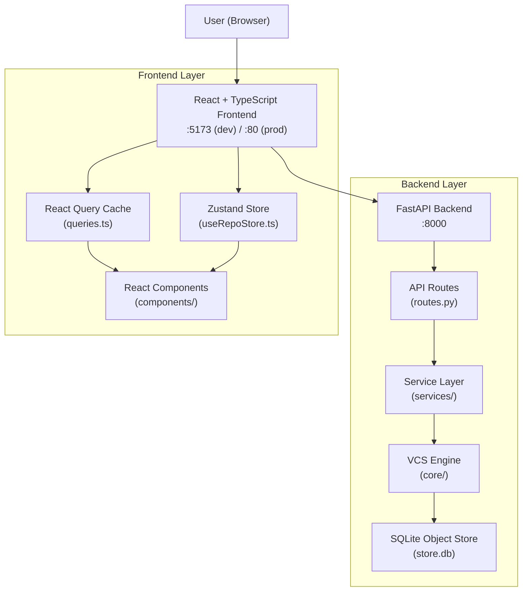

### Technology stack

| Layer | Technology | Purpose |
|-------|-----------|---------|
| Frontend framework | React 19 + TypeScript | Component-based UI |
| Build tool | Vite 8 | Fast dev server + optimized builds |
| Styling | TailwindCSS 3 + `tailwindcss-animate` | Utility-first CSS |
| Animations | Framer Motion 12 | Smooth transitions |
| Graph visualization | React Flow (xyflow) 12 | Interactive commit DAG |
| Charts | Recharts 3 | Analytics dashboard |
| State (server) | TanStack React Query 5 | Cached server state |
| State (UI) | Zustand 5 | Ephemeral view state |
| Backend framework | FastAPI (Python 3.12) | Type-safe REST API |
| Database | SQLite 3 | Embedded object store |
| Container | Docker + docker-compose | Consistent deployment |

---

## 2. Backend Layers

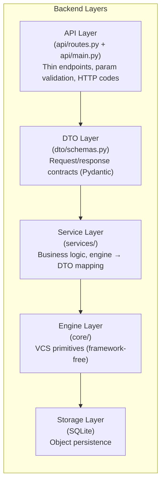

### API layer (`app/api/`)

| File | Responsibility |
|------|---------------|
| `routes.py` | 16 thin endpoints: parse params, call service, return DTO |
| `dependencies.py` | FastAPI `Depends` wiring; creates `RepoService` per request |
| `main.py` | App factory, lifespan (provider init), CORS, two top-level routes |

### DTO layer (`app/dto/`)

All request/response models are Pydantic `BaseModel` subclasses. They:
- Validate input at the API boundary.
- Define the exact JSON contract the frontend receives.
- Keep transport shapes independent of engine internals.

### Service layer (`app/services/`)

| Service | Methods | Purpose |
|---------|---------|---------|
| `RepoService` | `stage`, `commit`, `log`, `branches`, `status`, `diff`, `file_history`, `merge`, `blame`, `restore`, `inspect_commit`, `create_branch`, `checkout` | Primary repository operations |
| `GraphService` | `build_graph` | Build React Flow DTO with lane layout |
| `AnalyticsService` | `overview` | Stats, heatmaps, contributor metrics |
| `InsightService` | `commit_insights`, `repo_insights` | Rule-based heuristics per commit |
| `import_service` | `import_github` | Clone + replay external repos |

### Engine layer (`app/core/`)

| Module | File | Dependencies |
|--------|------|-------------|
| `hashing` | `hashing.py` | `hashlib` |
| `objects` | `objects.py` | `hashing` |
| `object_store` | `object_store.py` | `objects`, `sqlite3` |
| `refs` | `refs.py` | SQLite |
| `index` | `index.py` | SQLite |
| `diff` | `diff.py` | None (pure algorithm) |
| `dag` | `dag.py` | `objects` |
| `merge` | `merge.py` | `diff` |
| `repository` | `repository.py` | All of the above |

---

## 3. Frontend Layers

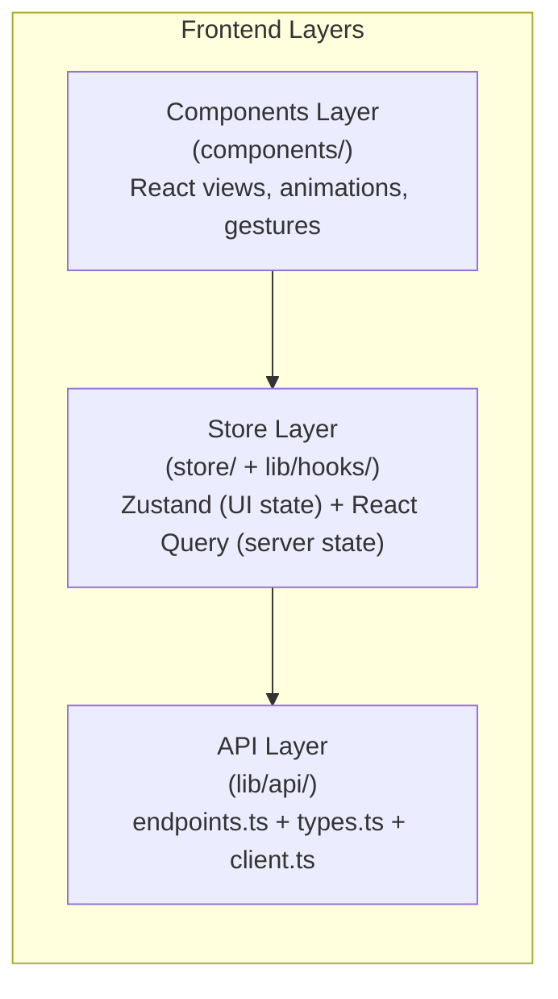

### Component hierarchy

```
App
├── Providers (QueryClient, TooltipProvider)
├── AppShell
│   ├── Sidebar
│   │   ├── Brand
│   │   ├── Nav (graph / files / analytics)
│   │   ├── BranchList
│   │   └── Footer actions (search, timemachine, import, palette)
│   ├── TopBar
│   │   ├── Repo identity + RepoSwitcher
│   │   ├── Search trigger
│   │   └── Time Machine + ⌘K buttons
│   ├── MainPanel (router)
│   │   ├── CommitGraph (React Flow DAG)
│   │   ├── FileExplorer (file tree + content + history)
│   │   │   └── BlameAnnotations (per-line blame)
│   │   ├── AnalyticsDashboard (charts + stats)
│   │   └── WelcomeStage (landing screen)
│   ├── RightPanel
│   │   └── RightPanelContent
│   │       ├── CommitInspector (commit details + diff)
│   │       └── InsightsFeed
│   └── BottomBar (activity log)
├── CommandPalette (⌘K)
└── ImportRepoDialog (modal)
```

### UI primitives (`components/ui/`)

```
badge.tsx    button.tsx    card.tsx    dialog.tsx
popover.tsx  scroll-area.tsx  separator.tsx  skeleton.tsx  tooltip.tsx
```

These are shadcn-style Radix primitives reused across the app.

---

## 4. Data Flow

### Read path (e.g., loading the commit graph)

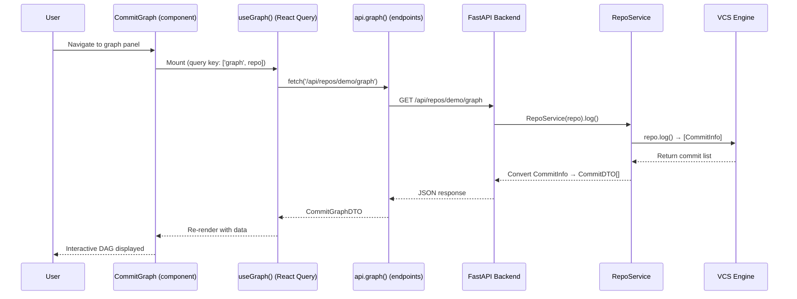

### Write path (e.g., creating a commit)

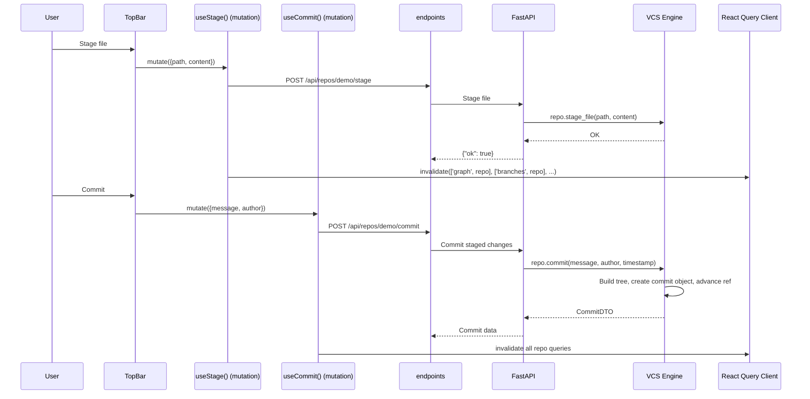

---

## 5. Repository Lifecycle

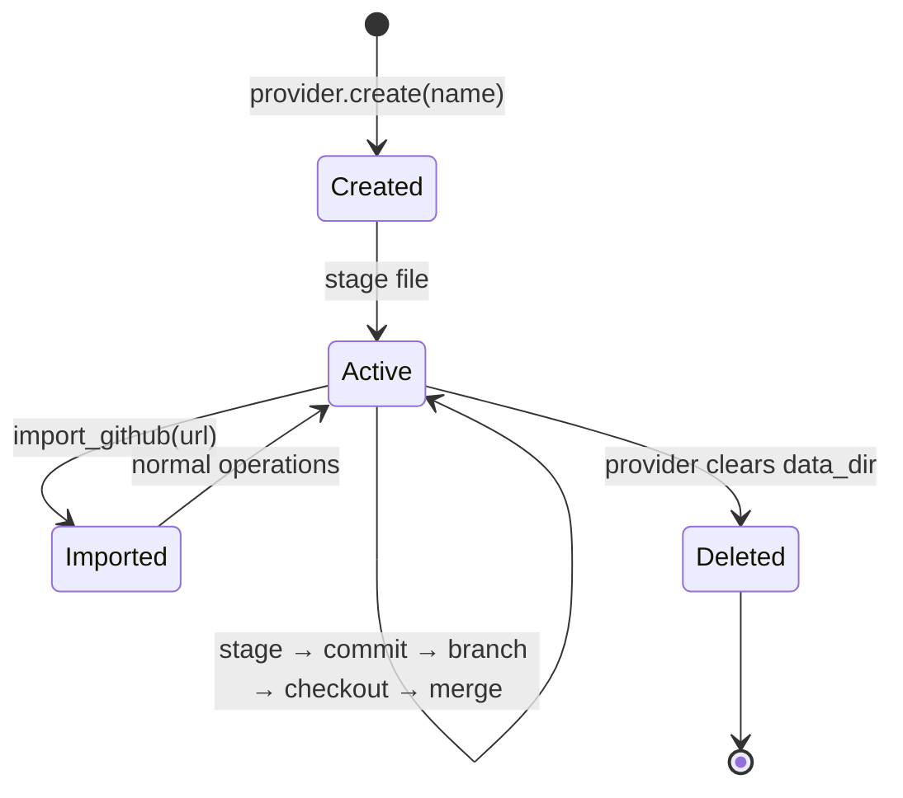

---

## 6. Import Flow

When a user imports a GitHub repository:

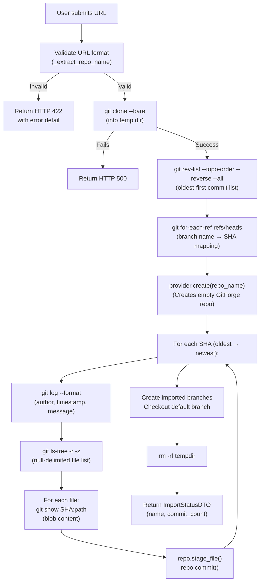

---

## 7. Blame Flow

When a user requests blame on a file:

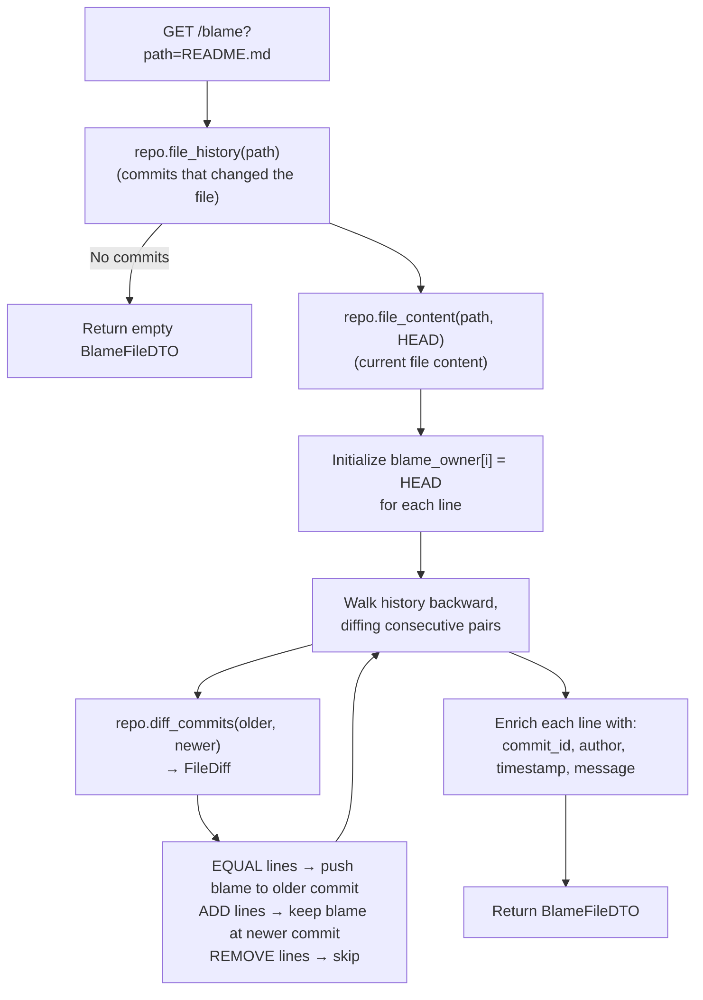

---

## 8. Restore Flow

When a user restores a file from history:

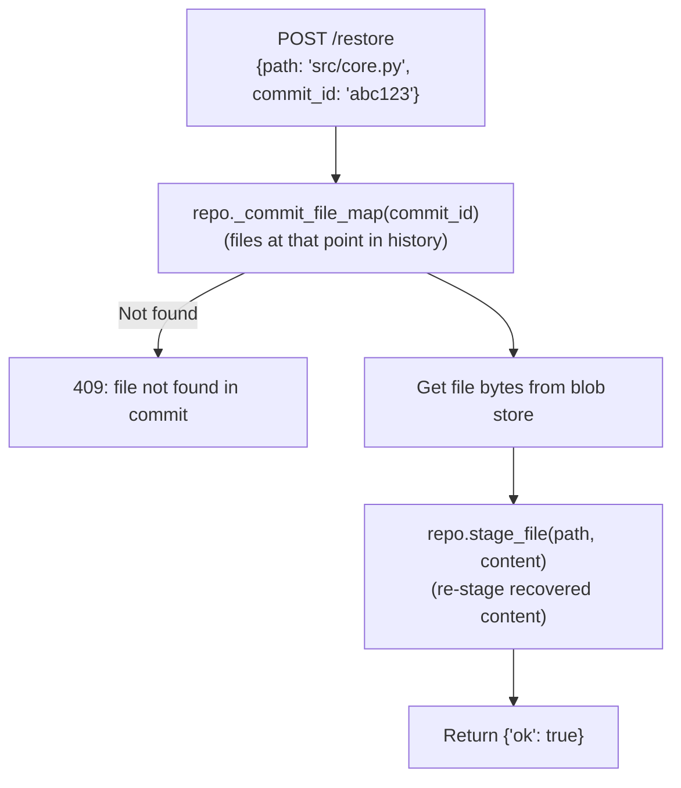

---

## 9. Analytics Pipeline

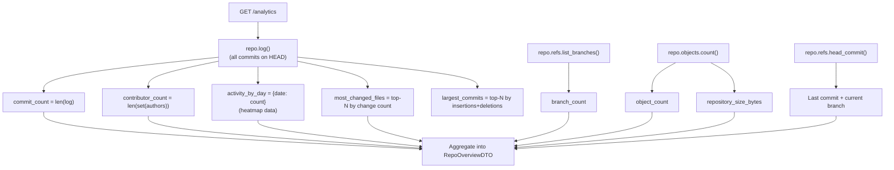

---

## 10. React Query Flow

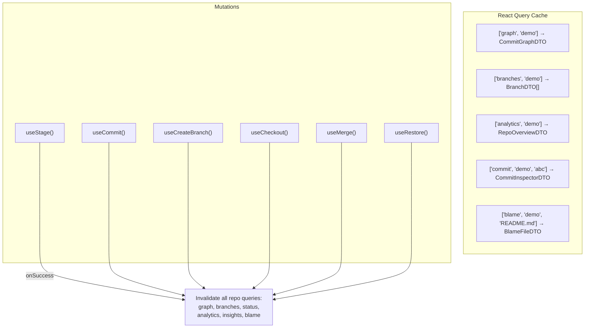

Query keys are namespaced by repository name, so switching repos transparently re-fetches with the correct cache namespace. Stale time is generous (5 minutes) because a repository's history is immutable between mutations.

---

## 11. Zustand Store

The Zustand store holds only **ephemeral UI state**. All server data lives in React Query.

```typescript
interface RepoState {
  // Current repository
  repo: string

  // Selection / hover
  selectedCommitId: string | null
  hoveredCommitId: string | null
  inspectorOpen: boolean

  // Navigation
  activePanel: 'graph' | 'analytics' | 'files'
  activeBranch: string | null

  // Search
  searchQuery: string
  searchOpen: boolean

  // Command palette
  paletteOpen: boolean

  // Import dialog
  importDialogOpen: boolean

  // Activity log (mutation feedback in BottomBar)
  activity: string[]

  // Time Machine
  timeMachine: {
    enabled: boolean
    cursor: number  // unix seconds
    playing: boolean
    speed: number
  }
}
```

### State model rule

> **Server data** lives in React Query (async, cached, stale-aware).  
> **UI state** lives in Zustand (sync, derived, view-local).  
> **Time Machine cursor** is pure derived state — it filters the React Query cache by timestamp.

---

## 12. Object Storage

### Physical layout

```
<data_dir>/<name>.gitforge/store.db
```

A single SQLite file contains everything:

| Table | Rows | Purpose |
|-------|------|---------|
| `objects` | Object count | Full content-addressable object store |
| `refs` | Branch count | Branch name → commit hash |
| `head` | 1–2 | Current branch + optional detached HEAD |
| `index` | Staged files | Path → blob hash for staging area |

### Object lifecycle

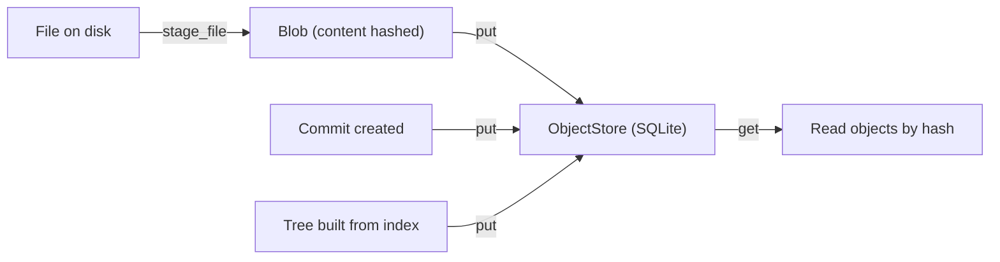

---

## Further reading

- [Concept Handbook](../01_Concept_Handbook/) — Foundational concepts.
- [Developer Guide](../03_Developer_Guide/) — Per-module reference.
- [API Documentation](../04_API_Documentation/) — Endpoint specifications.
