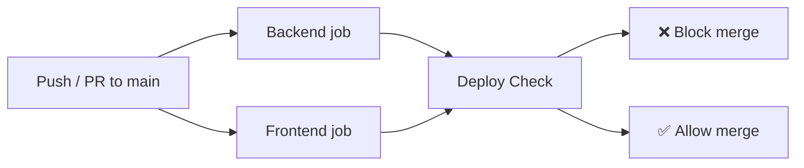

# GitForge Deployment Guide

Local development setup, Docker deployment, docker-compose orchestration, GitHub Actions CI/CD, and production configuration.

---

## Table of Contents

- [Local Development](#local-development)
- [Docker](#docker)
- [Docker Compose](#docker-compose)
- [GitHub Actions CI](#github-actions-ci)
- [Environment Variables](#environment-variables)
- [Production Deployment](#production-deployment)
- [Nginx Configuration](#nginx-configuration)
- [Ports Reference](#ports-reference)
- [Troubleshooting](#troubleshooting)

---

## Local Development

### Prerequisites

- Python 3.11+
- Node.js 22+
- npm

### Backend

```bash
cd backend

# Create virtual environment
python -m venv .venv
source .venv/bin/activate  # or `.venv\Scripts\activate` on Windows

# Install dependencies
pip install fastapi uvicorn[standard] pydantic

# Start dev server with auto-reload
python -m uvicorn app.main:app --reload --port 8000
```

The backend starts at `http://localhost:8000`. The demo repository is seeded on first access.

### Frontend

```bash
cd frontend

# Install dependencies
npm install

# Start Vite dev server (with API proxy to :8000)
npm run dev
```

The frontend starts at `http://localhost:5173`. The Vite dev server proxies `/api/*` requests to the backend at `localhost:8000`.

### Environment variables

| Variable | Default | Description |
|----------|---------|-------------|
| `GITFORGE_DATA` | `~/.gitforge-data` | Directory for repository SQLite databases |
| `VITE_API_URL` | (undefined) | Custom API base URL (omit for dev proxy) |

---

## Docker

### Backend image

```dockerfile
FROM python:3.12-slim
WORKDIR /app
COPY pyproject.toml ./
RUN pip install --no-cache-dir fastapi uvicorn[standard] pydantic
COPY cli.py app/ ./app/
EXPOSE 8000
CMD ["uvicorn", "app.main:app", "--host", "0.0.0.0", "--port", "8000"]
```

**Build:**
```bash
docker build -t gitforge-backend ./backend
```

**Run:**
```bash
docker run -d \
  -p 8000:8000 \
  -v gitforge-data:/root/.gitforge-data \
  -e GITFORGE_DATA=/root/.gitforge-data \
  gitforge-backend
```

### Frontend image (multi-stage)

```dockerfile
# Stage 1: Build
FROM node:22-alpine AS builder
WORKDIR /app
COPY package.json package-lock.json ./
RUN npm ci
COPY . .
RUN npm run build

# Stage 2: Serve
FROM nginx:alpine
COPY nginx.conf /etc/nginx/conf.d/default.conf
COPY --from=builder /app/dist /usr/share/nginx/html
EXPOSE 80
CMD ["nginx", "-g", "daemon off;"]
```

**Build:**
```bash
docker build -t gitforge-frontend ./frontend
```

**Run:**
```bash
docker run -d -p 80:80 gitforge-frontend
```

---

## Docker Compose

The recommended way to run GitForge locally is via docker-compose:

```yaml
services:
  backend:
    build: ./backend
    container_name: gitforge-backend
    ports:
      - "8000:8000"
    volumes:
      - gitforge-data:/root/.gitforge-data
    environment:
      - GITFORGE_DATA=/root/.gitforge-data
    restart: unless-stopped

  frontend:
    build: ./frontend
    container_name: gitforge-frontend
    ports:
      - "80:80"
    depends_on:
      - backend
    restart: unless-stopped

volumes:
  gitforge-data:
```

### Commands

```bash
# Start all services
docker compose up -d

# View logs
docker compose logs -f

# Rebuild after code changes
docker compose build --no-cache

# Stop services
docker compose down

# Stop and delete volumes (wipes imported repos)
docker compose down -v
```

### URLs

| Service | URL |
|---------|-----|
| Frontend | http://localhost |
| Backend API | http://localhost:8000 |
| Health check | http://localhost/api/health |

---

## GitHub Actions CI

The CI workflow `.github/workflows/ci.yml` runs on every push and pull request to `main`.

### Jobs



### `backend` job
1. `actions/checkout@v4`
2. `actions/setup-python@v5` (Python 3.12, pip cache)
3. Install: `fastapi`, `uvicorn`, `pydantic`, `pytest`, `httpx`
4. Lint: `pyflakes app/ tests/ cli.py`
5. Test: `python -m pytest tests/ -v`

### `frontend` job
1. `actions/checkout@v4`
2. `actions/setup-node@v4` (Node 22, npm cache)
3. `npm ci`
4. TypeScript: `npx tsc --noEmit`
5. Lint: `npm run lint`
6. Test: `npm test`
7. Build: `npm run build`

### `deploy-check` job
1. `docker/setup-buildx-action@v3`
2. `docker/build-push-action@v6` — build backend image (no push)
3. `docker/build-push-action@v6` — build frontend image (no push)

---

## Production Deployment

### Requirements

- Docker and docker-compose installed on the target machine.
- Ports 80 (frontend) and 8000 (backend) accessible.
- Sufficient disk space for repository data (SQLite files).

### Steps

```bash
# Clone the repository
git clone https://github.com/prayushsinghrathore/GitForge.git
cd GitForge

# Build and start
docker compose up -d

# Verify health
curl http://localhost/api/health

# Monitor logs
docker compose logs -f
```

### Data persistence

Repository data is stored in a Docker volume `gitforge-data` mounted at `/root/.gitforge-data`. The volume persists across container restarts. To back it up:

```bash
docker run --rm -v gitforge-data:/data -v $(pwd):/backup alpine \
  tar czf /backup/gitforge-backup.tar.gz -C /data .
```

### Security considerations

- The backend CORS middleware currently allows all origins (`allow_origins=["*"]`). For production, restrict to your frontend domain.
- The backend has no authentication layer. It is designed for local/trusted-network use.
- The nginx reverse proxy provides a single entry point and hides the backend port.

---

## Nginx Configuration

The frontend nginx config (`frontend/nginx.conf`) serves the SPA and proxies API requests:

```nginx
server {
    listen 80;
    server_name _;
    root /usr/share/nginx/html;
    index index.html;

    # Proxy API requests to the backend container
    location /api/ {
        proxy_pass http://backend:8000;
        proxy_set_header Host $host;
        proxy_set_header X-Real-IP $remote_addr;
        proxy_set_header X-Forwarded-For $proxy_add_x_forwarded_for;
    }

    # SPA client-side routing
    location / {
        try_files $uri $uri/ /index.html;
    }
}
```

Key points:
- `/api/*` requests are forwarded to the backend service (docker-compose network resolves `backend` to the container).
- All other requests serve static files or fall back to `index.html` for SPA routing.
- The backend port (8000) is not exposed externally — all traffic goes through port 80.

---

## Ports Reference

| Port | Service | Environment | Notes |
|------|---------|-------------|-------|
| 5173 | Frontend (Vite) | Development | Hot reload, API proxy to :8000 |
| 8000 | Backend (FastAPI) | Development / Docker | Direct API access |
| 80 | Frontend (nginx) | Docker (production) | Reverse-proxies /api to backend |

---

## Troubleshooting

### Backend won't start

```bash
# Check for port conflicts
lsof -i :8000

# Verify Python version >= 3.11
python --version

# Check data directory permissions
ls -la ~/.gitforge-data/
```

### Frontend can't reach backend

```bash
# In dev mode, verify Vite proxy is working
curl http://localhost:5173/api/health

# In Docker, verify containers are on the same network
docker compose ps
docker compose logs backend
```

### Docker build fails

```bash
# Rebuild without cache
docker compose build --no-cache

# Check Docker version
docker --version
docker compose version
```

### Import fails

```bash
# Ensure git is installed
git --version

# Check network connectivity to GitHub
curl https://github.com

# Check data directory disk space
df -h ~/.gitforge-data/
```

---

## Further reading

- [API Documentation](../04_API_Documentation/) — Endpoint reference.
- [Testing Guide](../05_Testing_Guide/) — CI pipeline details.
- [Developer Guide](../03_Developer_Guide/) — Local development setup.
